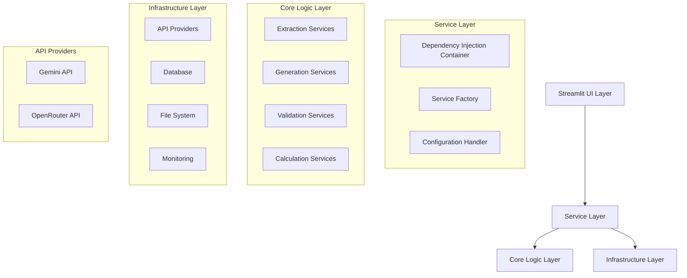

# Backend-Frontend Integration Fix Design

## Overview

This design document outlines the technical approach for resolving all backend errors and achieving complete frontend-backend integration for the QME system. The solution focuses on systematic error resolution, proper service architecture, and robust API integration to create a stable, production-ready system.

## Architecture

### Current System State Analysis

The system currently suffers from several architectural issues:

1. **Import Path Inconsistencies**: Services have been moved between directories but import statements haven't been updated
2. **Missing Module Implementations**: Some services exist in Python cache but not in source code
3. **Broken Service Dependencies**: Dependency injection and service registration are incomplete
4. **Incomplete API Integration**: OpenRouter API integration is partially implemented
5. **UI-Backend Disconnection**: Streamlit UI cannot properly instantiate backend services

### Target Architecture



## Components and Interfaces

### 1. Import Resolution System

**Purpose**: Systematically resolve all import path issues

**Components**:
- `ImportAnalyzer`: Scans all Python files for import statements
- `PathResolver`: Maps old import paths to new correct paths
- `ImportFixer`: Automatically updates import statements

**Interface**:
```python
class ImportResolver:
    def analyze_imports(self) -> Dict[str, List[ImportIssue]]
    def resolve_paths(self, issues: List[ImportIssue]) -> List[PathMapping]
    def fix_imports(self, mappings: List[PathMapping]) -> FixResult
```

### 2. Missing Module Implementation System

**Purpose**: Create complete production-ready implementations for missing modules

**Components**:
- `ModuleScanner`: Identifies missing modules from import statements
- `ServiceImplementor`: Creates full implementations with proper functionality
- `IntegrationValidator`: Ensures implementations integrate with existing system

**Interface**:
```python
class MissingModuleImplementor:
    def scan_missing_modules(self) -> List[MissingModule]
    def implement_services(self, modules: List[MissingModule]) -> ImplementationResult
    def validate_integration(self, services: List[ServiceImplementation]) -> ValidationResult
```

### 3. Service Integration Layer

**Purpose**: Ensure proper service instantiation and dependency injection

**Components**:
- `ServiceRegistry`: Central registry for all services
- `DependencyResolver`: Resolves service dependencies
- `ServiceFactory`: Creates service instances with proper configuration

**Interface**:
```python
class ServiceIntegrationLayer:
    def register_services(self) -> RegistrationResult
    def resolve_dependencies(self) -> DependencyResult
    def create_service_instances(self) -> ServiceInstances
```

### 4. Dual API Provider System

**Purpose**: Support both Gemini and OpenRouter APIs with fallback

**Components**:
- `APIProviderFactory`: Creates appropriate API provider instances
- `APIFallbackHandler`: Manages fallback between providers
- `APIConfigurationValidator`: Validates API configurations

**Interface**:
```python
class DualAPIProvider:
    def get_primary_provider(self) -> APIProvider
    def get_fallback_provider(self) -> APIProvider
    def execute_with_fallback(self, operation: APIOperation) -> APIResult
```

### 5. UI Integration Bridge

**Purpose**: Bridge Streamlit UI with backend services

**Components**:
- `UIServiceBridge`: Provides UI-friendly interfaces to backend services
- `ErrorHandler`: Converts backend errors to user-friendly messages
- `StateManager`: Manages UI state and backend service state synchronization

**Interface**:
```python
class UIIntegrationBridge:
    def initialize_services(self) -> ServiceInitResult
    def handle_ui_operations(self, operation: UIOperation) -> UIResult
    def manage_error_display(self, error: Exception) -> UserMessage
```

## Data Models

### Import Issue Model
```python
@dataclass
class ImportIssue:
    file_path: str
    line_number: int
    import_statement: str
    error_type: str
    suggested_fix: str
```

### Service Definition Model
```python
@dataclass
class ServiceDefinition:
    service_name: str
    module_path: str
    dependencies: List[str]
    interface_methods: List[str]
    configuration_keys: List[str]
```

### API Configuration Model
```python
@dataclass
class APIConfiguration:
    provider_name: str
    api_key: str
    base_url: str
    timeout: int
    retry_count: int
    fallback_provider: Optional[str]
```

## Error Handling

### Import Error Resolution
1. **Detection**: Scan all Python files for import statements
2. **Analysis**: Identify broken imports and their root causes
3. **Resolution**: Apply systematic fixes based on error patterns
4. **Validation**: Verify all imports work after fixes

### Service Instantiation Errors
1. **Dependency Mapping**: Map all service dependencies
2. **Circular Dependency Detection**: Identify and resolve circular dependencies
3. **Missing Service Creation**: Generate placeholder services for missing dependencies
4. **Integration Testing**: Verify all services can be instantiated

### API Integration Errors
1. **Configuration Validation**: Validate API keys and endpoints
2. **Connection Testing**: Test connectivity to both API providers
3. **Fallback Implementation**: Implement automatic fallback mechanisms
4. **Error Propagation**: Ensure API errors are properly handled and displayed

## Testing Strategy

### Unit Testing
- Test import resolution logic
- Test service instantiation
- Test API provider switching
- Test error handling mechanisms

### Integration Testing
- Test complete UI startup process
- Test end-to-end document processing workflows
- Test API fallback scenarios
- Test configuration loading and validation

### System Testing
- Test complete system startup from clean state
- Test all UI pages and functionality
- Test system behavior under various error conditions
- Test system performance and stability

## Implementation Phases

### Phase 1: Critical Import Resolution
1. Scan all files for import issues
2. Create comprehensive mapping of correct import paths
3. Systematically fix all import statements
4. Verify basic module loading works

### Phase 2: Missing Module Implementation
1. Identify all missing modules from import analysis
2. Create complete production-ready implementations with full functionality
3. Implement proper error handling, logging, and monitoring integration
4. Test that all services work correctly and integrate with existing system

### Phase 3: Service Integration
1. Implement proper dependency injection container
2. Register all services with correct dependencies
3. Test service instantiation and communication
4. Resolve any remaining dependency issues

### Phase 4: API Integration
1. Complete OpenRouter API integration
2. Implement dual API provider system with fallback
3. Test both API providers independently
4. Test fallback mechanisms

### Phase 5: UI Integration
1. Fix all UI component imports and dependencies
2. Test Streamlit application startup
3. Test all UI pages and functionality
4. Implement proper error handling and user feedback

### Phase 6: Project Structure Organization
1. Move all test files from root to tests/ directory
2. Move implementation summaries to docs/implementation/
3. Remove duplicate and temporary files
4. Ensure clean project root with only essential files

### Phase 7: End-to-End Validation
1. Test complete document processing workflows
2. Test Q&A functionality with both API providers
3. Test template generation workflows
4. Validate system stability and performance