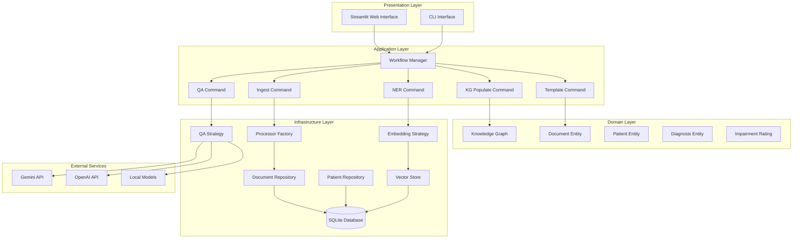

# Design Document

## Overview

This design refactors the existing document Q&A system into a knowledge graph-based architecture using clean architecture principles and proven design patterns. The system will process medical documents to build a comprehensive knowledge graph, enable intelligent Q&A over the knowledge base, and generate QME templates. The design emphasizes maintainability, testability, and extensibility while keeping SQLite as the primary storage backend for simplicity.

**POC Scope**: This design intentionally omits authentication, authorization, and audit logging for the POC phase. The focus is on core functionality with clean architecture patterns.

**Default Configuration**: 
- Embedding Provider: Local (SentenceTransformers)
- QA Provider: Gemini
- Knowledge Graph Storage: SQLite tables with in-memory graph structures
- Performance Target: Ingest and populate KG for a 50-page PDF within 30 seconds on typical dev machine

## Architecture

### High-Level Architecture



### Clean Architecture Layers

#### 1. Domain Layer (Core Business Logic)
- **Entities**: Document, Patient, Diagnosis, ImpairmentRating, Finding, Section
- **Value Objects**: MedicalCode, TemplateField, ProcessingStatus
- **Domain Services**: KnowledgeGraphService, MedicalCodingService
- **Repository Interfaces**: DocumentRepository, PatientRepository, KnowledgeRepository

#### 2. Application Layer (Use Cases)
- **Commands**: IngestCommand, NERCommand, KGPopulateCommand, QACommand, TemplateCommand
- **Orchestrators**: DocumentProcessingOrchestrator, QMEGenerationOrchestrator
- **DTOs**: DocumentDTO, PatientDTO, QARequestDTO, QAResponseDTO

#### 3. Infrastructure Layer (External Concerns)
- **Repositories**: SQLiteDocumentRepository, SQLitePatientRepository
- **Factories**: ProcessorFactory, EmbeddingStrategyFactory, QAStrategyFactory
- **Strategies**: OpenAIEmbeddingStrategy, LocalEmbeddingStrategy, HybridQAStrategy
- **Adapters**: GeminiAdapter, ChromaAdapter, FileSystemAdapter

#### 4. Presentation Layer (User Interface)
- **Web Interface**: Streamlit-based UI with components for upload, Q&A, and template generation
- **CLI Interface**: Command-line tools for batch processing and administration

## Components and Interfaces

### 1. Processor Factory (Factory Pattern)

**Purpose**: Creates appropriate document processors based on file type.

```python
class ProcessorFactory:
    @staticmethod
    def create_processor(file_type: str) -> DocumentProcessor:
        """Create processor for specific file type"""
        
    def register_processor(file_type: str, processor_class: Type[DocumentProcessor]) -> None:
        """Register new processor type"""

class DocumentProcessor(ABC):
    @abstractmethod
    def extract_text(self, file_path: str) -> str:
        """Extract text from document"""
        
    @abstractmethod
    def extract_metadata(self, file_path: str) -> Dict[str, Any]:
        """Extract document metadata"""

class PDFProcessor(DocumentProcessor):
    def extract_text(self, file_path: str) -> str:
        """Extract text using PyPDF2 and OCR fallback"""
        
class DOCXProcessor(DocumentProcessor):
    def extract_text(self, file_path: str) -> str:
        """Extract text using python-docx"""
```

### 2. Strategy Pattern Implementation

**Embedding Strategy**:
```python
class EmbeddingStrategy(ABC):
    @abstractmethod
    def generate_embeddings(self, text: str) -> List[float]:
        """Generate embeddings for text"""

class OpenAIEmbeddingStrategy(EmbeddingStrategy):
    def generate_embeddings(self, text: str) -> List[float]:
        """Use OpenAI embeddings API"""

class LocalEmbeddingStrategy(EmbeddingStrategy):
    def generate_embeddings(self, text: str) -> List[float]:
        """Use local sentence transformers"""
```

**QA Strategy**:
```python
class QAStrategy(ABC):
    @abstractmethod
    def answer_question(self, question: str, context: List[str]) -> QAResponse:
        """Generate answer using retrieval + LLM"""

class HybridQAStrategy(QAStrategy):
    def __init__(self, retrieval_strategy: RetrievalStrategy, llm_strategy: LLMStrategy):
        self.retrieval = retrieval_strategy
        self.llm = llm_strategy
        
    def answer_question(self, question: str, context: List[str]) -> QAResponse:
        """Combine vector search and graph traversal for retrieval"""
```

### 3. Repository Pattern (Data Access)

```python
class DocumentRepository(ABC):
    @abstractmethod
    def save(self, document: Document) -> str:
        """Save document and return ID"""
        
    @abstractmethod
    def find_by_id(self, doc_id: str) -> Optional[Document]:
        """Find document by ID"""
        
    @abstractmethod
    def find_by_criteria(self, criteria: Dict[str, Any]) -> List[Document]:
        """Find documents matching criteria"""

class SQLiteDocumentRepository(DocumentRepository):
    def __init__(self, db_path: str):
        self.db_path = db_path
        
    def save(self, document: Document) -> str:
        """SQLite implementation"""
```

### 4. Command Pattern (Workflow Operations)

```python
class Command(ABC):
    @abstractmethod
    def execute(self) -> CommandResult:
        """Execute the command"""
        
    @abstractmethod
    def can_retry(self) -> bool:
        """Check if command can be retried"""

@retry_on_failure(max_attempts=3, backoff_factor=2)
class IngestCommand(Command):
    def __init__(self, file_path: str, processor_factory: ProcessorFactory):
        self.file_path = file_path
        self.processor_factory = processor_factory
        
    def execute(self) -> CommandResult:
        """Execute document ingestion"""

class NERCommand(Command):
    def __init__(self, document_id: str, embedding_strategy: EmbeddingStrategy):
        self.document_id = document_id
        self.embedding_strategy = embedding_strategy
        
    def execute(self) -> CommandResult:
        """Execute named entity recognition"""

class KGPopulateCommand(Command):
    def __init__(self, entities: List[Entity], kg_service: KnowledgeGraphService):
        self.entities = entities
        self.kg_service = kg_service
        
    def execute(self) -> CommandResult:
        """Populate knowledge graph with entities stored in SQLite tables"""

class TemplateCommand(Command):
    def __init__(self, patient_id: str, template_generator: QMETemplateGenerator):
        self.patient_id = patient_id
        self.template_generator = template_generator
        
    def execute(self) -> CommandResult:
        """Generate QME template in DOCX format following AI Example QME Report Template.docx structure"""
```

### 5. Knowledge Graph Schema

**Node Types**:
- **Document**: id, title, file_type, file_path, processing_status
- **Section**: id, document_id, section_type, page_number, text_content
- **Patient**: id, name, age, gender, case_number, medical_record_number
- **Claim**: id, patient_id, claim_number, injury_date, body_parts
- **Diagnosis**: id, icd_code, description, severity, certainty
- **Finding**: id, section_id, finding_type, description, page_reference
- **ImagingStudy**: id, study_type, date, findings, interpretation
- **ImpairmentRating**: id, diagnosis_id, ama_table, percentage, rationale

**Relationship Types**:
- Document → Section (HAS_SECTION)
- Section → Finding (CONTAINS_FINDING)
- Section → Diagnosis (CONTAINS_DIAGNOSIS)
- Patient → Claim (HAS_CLAIM)
- Claim → Diagnosis (INVOLVES_DIAGNOSIS)
- Diagnosis → ImpairmentRating (HAS_RATING)
- Finding → ImagingStudy (SUPPORTS_FINDING)

### 6. Ingestion Pipeline

**Pipeline Steps**:
1. **File Detection**: Monitor /data folder for new PDF/DOCX files
2. **Text Extraction**: Use appropriate processor from factory
3. **Section Segmentation**: Identify document sections (history, examination, etc.)
4. **Named Entity Recognition**: Extract medical entities using NER models
5. **Embedding Generation**: Create vector embeddings for semantic search
6. **Knowledge Graph Population**: Create nodes and relationships
7. **Indexing**: Update search indices for Q&A

```python
class IngestionPipeline:
    def __init__(self, 
                 processor_factory: ProcessorFactory,
                 embedding_strategy: EmbeddingStrategy,
                 kg_service: KnowledgeGraphService):
        self.processor_factory = processor_factory
        self.embedding_strategy = embedding_strategy
        self.kg_service = kg_service
        
    async def process_document(self, file_path: str) -> ProcessingResult:
        """Execute complete ingestion pipeline"""
        
        # Step 1: Text extraction
        processor = self.processor_factory.create_processor(file_path)
        text = processor.extract_text(file_path)
        
        # Step 2: Section segmentation
        sections = self.segment_document(text)
        
        # Step 3: NER
        entities = await self.extract_entities(sections)
        
        # Step 4: Embeddings
        embeddings = self.embedding_strategy.generate_embeddings(text)
        
        # Step 5: KG population
        await self.kg_service.populate_graph(entities, embeddings)
        
        return ProcessingResult(success=True, entities=entities)
```

## Data Models

### Core Domain Entities

```python
@dataclass
class Document:
    id: str
    title: str
    file_type: str
    file_path: str
    processing_status: ProcessingStatus
    created_at: datetime
    processed_at: Optional[datetime]
    metadata: Dict[str, Any]
    
    def is_processed(self) -> bool:
        return self.processing_status == ProcessingStatus.COMPLETED

@dataclass
class Patient:
    id: str
    name: str
    age: Optional[int]
    gender: Optional[str]
    case_number: str
    medical_record_number: Optional[str]
    claims: List[Claim] = field(default_factory=list)

@dataclass
class Diagnosis:
    id: str
    icd_code: str
    description: str
    severity: Optional[str]
    certainty: float  # 0.0 to 1.0
    source_section_id: str
    page_reference: int
    impairment_ratings: List[ImpairmentRating] = field(default_factory=list)

@dataclass
class ImpairmentRating:
    id: str
    diagnosis_id: str
    ama_table: str
    percentage: float
    rationale: str
    source_page: int
```

### Knowledge Graph Models

```python
@dataclass
class KnowledgeNode:
    id: str
    node_type: str
    properties: Dict[str, Any]
    embeddings: Optional[List[float]]
    created_at: datetime

@dataclass
class KnowledgeRelationship:
    id: str
    source_node_id: str
    target_node_id: str
    relationship_type: str
    properties: Dict[str, Any]
    confidence: float
```

## Error Handling

### Retry Decorator Implementation

```python
def retry_on_failure(max_attempts: int = 3, backoff_factor: float = 2.0):
    def decorator(func):
        @wraps(func)
        def wrapper(*args, **kwargs):
            last_exception = None
            
            for attempt in range(max_attempts):
                try:
                    return func(*args, **kwargs)
                except RetryableException as e:
                    last_exception = e
                    if attempt < max_attempts - 1:
                        sleep_time = backoff_factor ** attempt
                        logger.warning(f"Attempt {attempt + 1} failed, retrying in {sleep_time}s: {e}")
                        time.sleep(sleep_time)
                    else:
                        logger.error(f"All {max_attempts} attempts failed: {e}")
                        
            raise last_exception
        return wrapper
    return decorator
```

### Error Categories

1. **Retryable Errors**: Network timeouts, API rate limits, temporary file locks
2. **Non-Retryable Errors**: Invalid file formats, authentication failures, corrupted data
3. **Partial Failures**: Some entities extracted but others failed
4. **System Errors**: Database connection failures, disk space issues

## Testing Strategy

### Unit Tests

```python
class TestProcessorFactory:
    def test_create_pdf_processor(self):
        processor = ProcessorFactory.create_processor("pdf")
        assert isinstance(processor, PDFProcessor)
        
    def test_create_docx_processor(self):
        processor = ProcessorFactory.create_processor("docx")
        assert isinstance(processor, DOCXProcessor)

class TestEmbeddingStrategy:
    def test_openai_embedding_generation(self):
        strategy = OpenAIEmbeddingStrategy(api_key="test")
        embeddings = strategy.generate_embeddings("test text")
        assert len(embeddings) > 0
        assert all(isinstance(x, float) for x in embeddings)
```

### Integration Tests

```python
class TestEndToEndProcessing:
    def test_sample3_pdf_processing(self):
        # Test complete pipeline with Sample3.pdf
        pipeline = IngestionPipeline(
            processor_factory=ProcessorFactory(),
            embedding_strategy=LocalEmbeddingStrategy(),
            kg_service=KnowledgeGraphService()
        )
        
        result = pipeline.process_document("Sample3.pdf")
        
        # Verify knowledge graph nodes created
        assert result.success
        assert len(result.entities) > 0
        
        # Verify Q&A works
        qa_engine = QAEngine(qa_strategy=HybridQAStrategy())
        response = qa_engine.answer_question(
            "What is the patient's primary diagnosis?",
            document_id=result.document_id
        )
        
        assert response.answer is not None
        assert len(response.sources) > 0
```

### QME Template Generation Tests

```python
class TestQMEGeneration:
    def test_template_generation_format(self):
        # Test that generated template matches expected format
        generator = QMETemplateGenerator()
        template = generator.generate_template(patient_id="test_patient")
        
        # Verify required sections present
        assert "QUALIFIED MEDICAL EVALUATOR'S REPORT" in template
        assert "HISTORY OF PRESENT ILLNESS" in template
        assert "PHYSICAL EXAMINATION" in template
        assert "DIAGNOSIS" in template
        assert "IMPAIRMENT RATING" in template
```

## Performance Optimization

### Caching Strategy

```python
class CacheManager:
    def __init__(self):
        self.embedding_cache = {}
        self.entity_cache = {}
        
    def get_embeddings(self, text_hash: str) -> Optional[List[float]]:
        return self.embedding_cache.get(text_hash)
        
    def cache_embeddings(self, text_hash: str, embeddings: List[float]):
        self.embedding_cache[text_hash] = embeddings
```

### Async Processing

```python
class AsyncIngestionPipeline:
    async def process_multiple_documents(self, file_paths: List[str]) -> List[ProcessingResult]:
        tasks = [self.process_document(path) for path in file_paths]
        return await asyncio.gather(*tasks, return_exceptions=True)
```

## Configuration Management

### Environment Configuration

```python
@dataclass
class AppConfig:
    # Database
    database_path: str = "data/database/documents.db"
    
    # API Keys
    gemini_api_key: str = ""
    openai_api_key: str = ""
    
    # Processing
    max_file_size_mb: int = 10
    allowed_file_types: List[str] = field(default_factory=lambda: ["pdf", "docx", "txt"])
    
    # Embedding Strategy
    embedding_provider: str = "local"  # "openai" or "local"
    
    # QA Strategy
    qa_provider: str = "gemini"  # "gemini", "openai", or "local"
    
    @classmethod
    def from_env(cls) -> 'AppConfig':
        return cls(
            database_path=os.getenv("DATABASE_PATH", "data/database/documents.db"),
            gemini_api_key=os.getenv("GEMINI_API_KEY", ""),
            openai_api_key=os.getenv("OPENAI_API_KEY", ""),
            embedding_provider=os.getenv("EMBEDDING_PROVIDER", "local"),
            qa_provider=os.getenv("QA_PROVIDER", "gemini")
        )
```

## Deployment Considerations

### Knowledge Base Initialization

```python
class KnowledgeBaseInitializer:
    def __init__(self, pipeline: IngestionPipeline):
        self.pipeline = pipeline
        
    async def initialize_canonical_documents(self):
        """Initialize KB with canonical medical documents"""
        canonical_docs = [
            "AMAGuides 5th Edition.pdf",
            "QME-Study-Guide.pdf", 
            "Sample3.pdf"
        ]
        
        for doc_path in canonical_docs:
            if os.path.exists(doc_path):
                await self.pipeline.process_document(doc_path)
                logger.info(f"Processed canonical document: {doc_path}")
            else:
                logger.warning(f"Canonical document not found: {doc_path}")
```

### Security Considerations

**PII/PHI Protection**: PII/PHI in logs will be masked or omitted to prevent accidental exposure during POC development and testing.

### Health Checks

```python
class HealthChecker:
    def __init__(self, db_path: str, kg_service: KnowledgeGraphService):
        self.db_path = db_path
        self.kg_service = kg_service
        
    def check_database_health(self) -> bool:
        """Check if database is accessible"""
        try:
            conn = sqlite3.connect(self.db_path)
            conn.execute("SELECT 1")
            conn.close()
            return True
        except Exception:
            return False
            
    def check_knowledge_graph_health(self) -> bool:
        """Check if knowledge graph has minimum required nodes"""
        node_count = self.kg_service.get_node_count()
        return node_count > 0
```

This design provides a solid foundation for refactoring the existing system while maintaining functionality and adding the requested knowledge graph capabilities. The clean architecture approach ensures maintainability and testability, while the design patterns provide flexibility for future extensions.