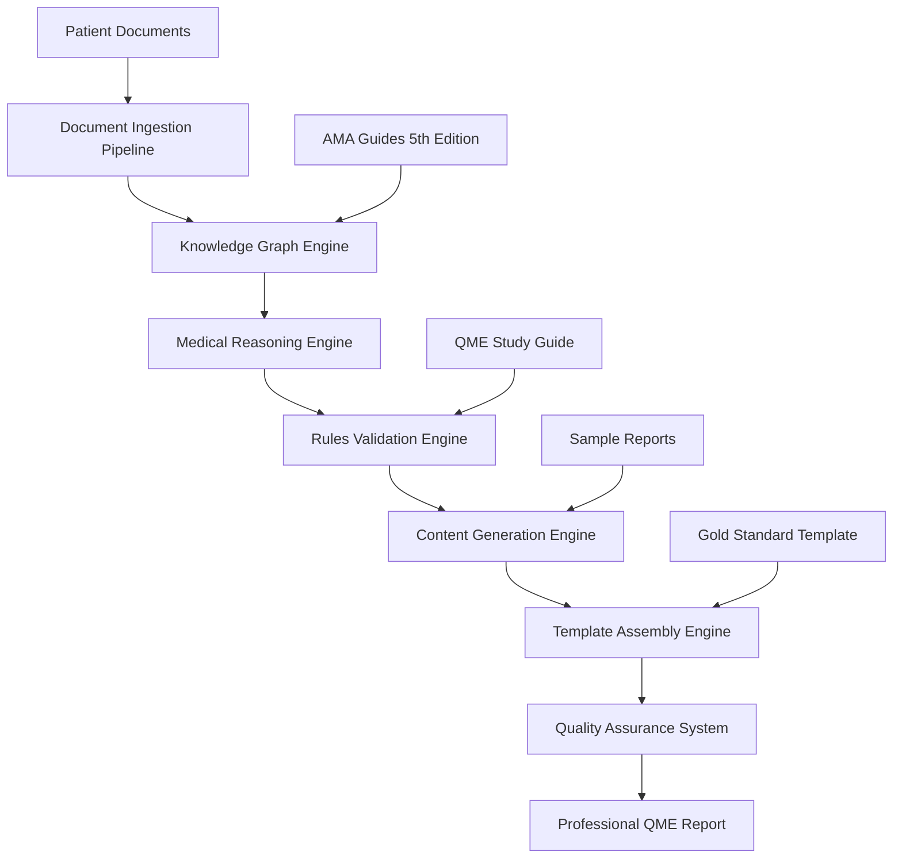

# Design Document

## Overview

The Enhanced QME Template Generation System is a sophisticated medical report generation platform that transforms patient medical records into gold-standard compliant QME (Qualified Medical Evaluator) reports. The system leverages advanced knowledge graph technology, comprehensive rules engines, and intelligent content generation to produce professional-quality medical-legal reports that meet California workers' compensation requirements.

The system processes patient documents (PQME files) through a multi-stage pipeline: document ingestion → knowledge graph population → rules-based validation → intelligent content generation → professional template assembly. Each stage incorporates medical domain expertise, legal compliance requirements, and quality assurance mechanisms.

## Architecture

### High-Level Architecture



### System Components

#### 1. Enhanced Document Processing Pipeline
- **Intelligent Document Chunker**: Semantic boundary detection preserving medical context
- **Medical Entity Extractor**: Advanced NER for medical concepts, diagnoses, treatments
- **Relationship Mapper**: Establishes connections between medical entities
- **Provenance Tracker**: Maintains source references for all extracted information

#### 2. Knowledge Graph Engine
- **Medical Ontology**: Structured representation of medical knowledge
- **Entity Relationship Manager**: Handles complex medical relationships
- **AMA Guidelines Integration**: Incorporates impairment rating rules and tables
- **Legal Requirements Database**: Stores regulatory compliance requirements

#### 3. Advanced Rules Engine
- **YAML Configuration System**: Flexible rule definition and management
- **Multi-Priority Validation**: MUST/SHOULD/MAY rule categories
- **Audit Trail System**: Complete validation history and provenance
- **Real-time Quality Assessment**: Continuous quality scoring during generation

#### 4. Intelligent Content Generation
- **Medical Reasoning Module**: Generates coherent medical narratives
- **Legal Compliance Generator**: Ensures regulatory text inclusion
- **Calculation Engine**: Performs AMA impairment calculations
- **Citation Manager**: Maintains proper medical and legal references

#### 5. Professional Template Assembly
- **Gold Standard Formatter**: Matches exact template structure and formatting
- **Dynamic Content Population**: Intelligent placeholder replacement
- **Quality Validation**: Pre and post-assembly validation
- **Professional Output Generation**: DOCX with proper medical formatting

## Components and Interfaces

### Core Interfaces

#### IEnhancedDocumentProcessor
```python
class IEnhancedDocumentProcessor:
    def process_patient_documents(self, documents: List[PatientDocument]) -> ProcessingResult
    def extract_medical_entities(self, content: str) -> List[MedicalEntity]
    def establish_relationships(self, entities: List[MedicalEntity]) -> RelationshipGraph
    def maintain_provenance(self, entity: MedicalEntity, source: DocumentSource) -> ProvenanceRecord
```

#### IKnowledgeGraphEngine
```python
class IKnowledgeGraphEngine:
    def populate_medical_knowledge(self, entities: List[MedicalEntity]) -> KnowledgeGraph
    def query_related_concepts(self, concept: MedicalConcept) -> List[RelatedConcept]
    def integrate_ama_guidelines(self, diagnosis: Diagnosis) -> AMAGuideline
    def resolve_entity_conflicts(self, entities: List[MedicalEntity]) -> List[MedicalEntity]
```

#### IAdvancedRulesEngine
```python
class IAdvancedRulesEngine:
    def load_yaml_rules(self, rules_file: str) -> List[ValidationRule]
    def validate_comprehensive(self, template_data: QMETemplateData) -> ValidationResult
    def generate_audit_trail(self, validation_session: ValidationSession) -> AuditTrail
    def calculate_quality_score(self, validation_issues: List[ValidationIssue]) -> QualityScore
```

#### IIntelligentContentGenerator
```python
class IIntelligentContentGenerator:
    def generate_medical_narrative(self, knowledge_graph: KnowledgeGraph) -> MedicalNarrative
    def apply_medical_reasoning(self, findings: List[MedicalFinding]) -> ReasoningResult
    def generate_legal_compliance_text(self, requirements: List[LegalRequirement]) -> ComplianceText
    def calculate_impairment_ratings(self, diagnoses: List[Diagnosis]) -> List[ImpairmentRating]
```

#### IProfessionalTemplateAssembler
```python
class IProfessionalTemplateAssembler:
    def assemble_gold_standard_template(self, content: GeneratedContent) -> QMEReport
    def apply_professional_formatting(self, document: Document) -> FormattedDocument
    def validate_template_completeness(self, template: QMETemplate) -> ValidationResult
    def generate_final_report(self, validated_template: QMETemplate) -> ProfessionalReport
```

### Data Models

#### Enhanced Medical Entities
```python
@dataclass
class EnhancedMedicalEntity:
    id: str
    entity_type: MedicalEntityType
    content: str
    confidence_score: float
    provenance: List[ProvenanceReference]
    relationships: List[EntityRelationship]
    ama_references: List[AMAReference]
    validation_status: ValidationStatus
```

#### Comprehensive Knowledge Graph
```python
@dataclass
class ComprehensiveKnowledgeGraph:
    entities: Dict[str, EnhancedMedicalEntity]
    relationships: List[MedicalRelationship]
    ama_guidelines: Dict[str, AMAGuideline]
    legal_requirements: Dict[str, LegalRequirement]
    quality_indicators: QualityMetrics
```

#### Advanced Validation Result
```python
@dataclass
class AdvancedValidationResult:
    validation_issues: List[ValidationIssue]
    quality_score: ComprehensiveQualityScore
    audit_trail: List[AuditEntry]
    compliance_status: ComplianceStatus
    improvement_recommendations: List[ImprovementRecommendation]
```

## Error Handling

### Comprehensive Error Management

#### 1. Document Processing Errors
- **Malformed Document Handling**: Graceful degradation for corrupted files
- **Encoding Issues**: Automatic encoding detection and conversion
- **Missing Content Recovery**: Intelligent gap filling and flagging
- **Large Document Management**: Streaming processing for oversized files

#### 2. Knowledge Graph Errors
- **Entity Conflict Resolution**: Automated merging with confidence scoring
- **Relationship Validation**: Consistency checking and correction
- **Missing Reference Handling**: Fallback to alternative sources
- **Circular Dependency Detection**: Graph cycle prevention and resolution

#### 3. Rules Engine Errors
- **Rule Execution Failures**: Graceful degradation with detailed logging
- **YAML Configuration Errors**: Validation and helpful error messages
- **Performance Optimization**: Timeout handling and resource management
- **Audit Trail Integrity**: Guaranteed audit record persistence

#### 4. Content Generation Errors
- **Medical Reasoning Failures**: Fallback to template-based generation
- **Legal Compliance Issues**: Mandatory requirement enforcement
- **Calculation Errors**: Verification and correction mechanisms
- **Citation Management**: Reference validation and correction

#### 5. Template Assembly Errors
- **Formatting Failures**: Automatic format correction and validation
- **Missing Content Handling**: Intelligent placeholder management
- **Quality Validation Failures**: Iterative improvement and correction
- **Output Generation Issues**: Multiple format fallbacks

### Error Recovery Strategies

#### Progressive Degradation
1. **Full Automation**: Complete AI-driven generation
2. **Assisted Generation**: AI with human validation points
3. **Template-Based**: Structured template with manual completion
4. **Manual Override**: Full human control with system assistance

#### Quality Assurance Gates
1. **Pre-Processing Validation**: Document quality and completeness
2. **Knowledge Graph Validation**: Entity and relationship consistency
3. **Rules Compliance Check**: Regulatory and quality requirements
4. **Content Quality Assessment**: Medical accuracy and completeness
5. **Final Template Validation**: Professional standards compliance

## Testing Strategy

### Comprehensive Testing Framework

#### 1. Unit Testing
- **Component Isolation**: Individual module testing with mocks
- **Medical Entity Extraction**: Accuracy and completeness validation
- **Rules Engine Logic**: Rule execution and validation testing
- **Content Generation**: Quality and accuracy assessment
- **Template Assembly**: Format and structure validation

#### 2. Integration Testing
- **Pipeline Flow**: End-to-end document processing validation
- **Knowledge Graph Integration**: Cross-component data consistency
- **Rules Engine Integration**: Validation workflow testing
- **Content Generation Integration**: Quality and compliance testing
- **Template Assembly Integration**: Professional output validation

#### 3. Medical Domain Testing
- **Clinical Accuracy**: Medical professional review and validation
- **AMA Guidelines Compliance**: Impairment rating accuracy testing
- **Legal Compliance**: Regulatory requirement validation
- **Professional Standards**: Industry standard compliance testing

#### 4. Performance Testing
- **Document Processing Speed**: Large document handling efficiency
- **Knowledge Graph Performance**: Complex query response times
- **Rules Engine Scalability**: High-volume validation performance
- **Content Generation Speed**: Real-time generation capability
- **Template Assembly Performance**: Professional output generation speed

#### 5. Quality Assurance Testing
- **Gold Standard Comparison**: Template quality benchmarking
- **Professional Review**: Medical expert evaluation
- **Regulatory Compliance**: Legal requirement validation
- **User Acceptance**: End-user satisfaction assessment

### Test Data Management

#### Medical Test Cases
- **Diverse Injury Types**: Comprehensive injury scenario coverage
- **Complex Medical Histories**: Multi-condition patient cases
- **Incomplete Documentation**: Missing information handling
- **Edge Cases**: Unusual or complex medical situations

#### Validation Test Scenarios
- **Complete Documentation**: Full information availability
- **Partial Documentation**: Missing critical information
- **Conflicting Information**: Inconsistent medical records
- **Regulatory Edge Cases**: Complex legal compliance scenarios

#### Performance Benchmarks
- **Processing Speed**: Sub-30-second generation for standard cases
- **Quality Metrics**: 90%+ accuracy for medical content
- **Compliance Rate**: 100% regulatory requirement satisfaction
- **User Satisfaction**: 85%+ professional acceptance rate