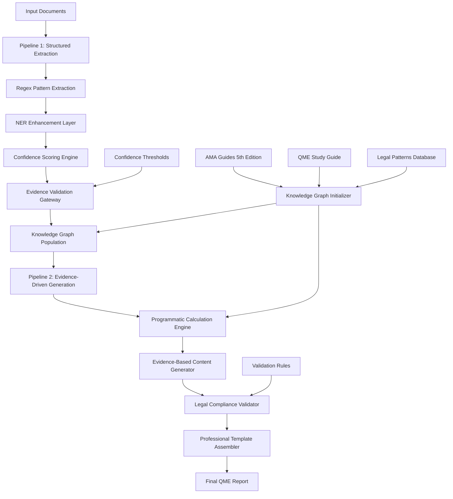

# Design Document

## Overview

The Evidence-First QME System Enhancement transforms the existing QME workflow into a deterministic, two-pipeline architecture that prioritizes evidence validation and programmatic calculations. The system processes medical-legal documents through Pipeline 1 (Structured Extraction & Validation) followed by Pipeline 2 (Evidence-Driven Generation & Compliance), ensuring every generated report is built from validated evidence with complete audit trails.

The architecture emphasizes reliability over speed, legal compliance over automation, and evidence provenance over content generation. All numeric calculations are performed programmatically using AMA Guidelines tables, while LLMs are restricted to narrative generation based on validated evidence.

## Architecture

### High-Level Two-Pipeline Architecture



### System Components

#### Pipeline 1: Structured Extraction & Validation

**1. Enhanced Document Processor**
- OCR preprocessing with confidence scoring
- Section segmentation (Header, History, Exam, Records Review, Impression)
- Document coordinate tracking for evidence provenance

**2. Deterministic Extraction Engine**
- Regex pattern matching for high-confidence field extraction
- NER enhancement for missed fields with probability scoring
- Cross-document validation for consistency checking

**3. Confidence Scoring System**
- Field-level confidence calculation (0.0-1.0 scale)
- Evidence snippet extraction with source coordinates
- Threshold-based acceptance/flagging/rejection logic

**4. Evidence Validation Gateway**
- Confidence threshold enforcement (critical: ≥0.8, standard: ≥0.5)
- Missing field identification and flagging
- Human-in-the-loop review queue management

#### Pipeline 2: Evidence-Driven Generation & Compliance

**1. Programmatic Calculation Engine**
- AMA Guidelines table lookup and application
- ROM measurement averaging and impairment calculation
- Combined Values Chart application with step-by-step documentation

**2. Evidence-Based Content Generator**
- RAG retrieval from validated knowledge graph content
- Narrative generation constrained by evidence snippets
- Citation management with source provenance

**3. Legal Compliance Validator**
- Mandatory section verification
- Labor Code 4062.3 declaration insertion
- Page count and billing unit calculation

**4. Professional Template Assembler**
- Gold standard template formatting
- Placeholder replacement with validated content
- Final quality assurance and completeness checking

## Components and Interfaces

### Core Pipeline Interfaces

#### IStructuredExtractionPipeline
```python
class IStructuredExtractionPipeline:
    def extract_with_confidence(self, document: Document) -> ExtractionResult
    def validate_evidence(self, extraction: ExtractionResult) -> ValidationReport
    def populate_knowledge_graph(self, validated_fields: Dict[str, Any]) -> KGPopulationResult
```

#### IEvidenceDrivenGenerationPipeline
```python
class IEvidenceDrivenGenerationPipeline:
    def calculate_impairments(self, validated_data: ValidatedData) -> CalculationResult
    def generate_evidence_content(self, evidence: EvidenceSet) -> ContentResult
    def validate_compliance(self, report: QMEReport) -> ComplianceResult
```

### Enhanced Data Models

#### ExtractionResult
```python
@dataclass
class ExtractionResult:
    fields: Dict[str, Any]
    confidences: Dict[str, float]
    evidence_snippets: Dict[str, EvidenceSnippet]
    source_coordinates: Dict[str, DocumentCoordinate]
    extraction_metadata: ExtractionMetadata
```

#### ValidationReport
```python
@dataclass
class ValidationReport:
    accepted_fields: Dict[str, Any]  # confidence ≥ 0.8
    flagged_fields: Dict[str, Any]   # 0.5 ≤ confidence < 0.8
    missing_fields: List[str]        # confidence < 0.5
    overall_confidence: float
    evidence_completeness: float
    can_generate_report: bool
```

#### ProgrammaticCalculationResult
```python
@dataclass
class ProgrammaticCalculationResult:
    impairment_percentage: float
    ama_table_references: List[AMATableReference]
    calculation_steps: List[CalculationStep]
    source_measurements: List[ROMMeasurement]
    validation_status: CalculationValidationStatus
```

## Error Handling

### Pipeline 1 Error Management

**1. Document Processing Errors**
- Malformed PDF handling with OCR fallback
- Encoding detection and automatic conversion
- Large document streaming with memory management

**2. Extraction Confidence Issues**
- Low confidence field flagging with human review queue
- Missing critical field detection with specific recommendations
- Cross-document inconsistency resolution

**3. Knowledge Graph Population Errors**
- Entity conflict resolution with confidence-based merging
- Relationship validation and consistency checking
- Circular dependency detection and prevention

### Pipeline 2 Error Management

**1. Calculation Engine Errors**
- AMA table lookup failures with fallback mechanisms
- Invalid measurement handling with validation messages
- Combined Values Chart edge case management

**2. Content Generation Issues**
- Evidence insufficiency handling with gap identification
- RAG retrieval failures with alternative source lookup
- Citation management with reference validation

**3. Compliance Validation Errors**
- Missing mandatory section detection with template insertion
- Legal language validation with automatic correction
- Format compliance checking with professional standards

## Testing Strategy

### Pipeline Integration Testing

**1. End-to-End Evidence Flow**
- Sample3.pdf processing with known expected values
- PQME document processing with field extraction validation
- Complete pipeline execution with audit trail verification

**2. Confidence Scoring Validation**
- Regex pattern accuracy testing with medical document corpus
- NER enhancement effectiveness measurement
- Cross-validation consistency checking

**3. Programmatic Calculation Testing**
- AMA Guidelines table accuracy verification
- ROM measurement calculation validation
- Combined Values Chart application testing

### Knowledge Graph Initialization Testing

**1. Canonical Document Processing**
- AMA Guides 5th Edition entity extraction validation
- QME Study Guide content structuring verification
- Legal pattern database population testing

**2. Initialization Completeness Validation**
- Node count verification (≥1000 nodes)
- Relationship count validation (≥500 relationships)
- Entity type coverage confirmation

**3. Option 2 Integration Testing**
- Run script option 2 execution validation
- Knowledge graph initialization status reporting
- System readiness verification after initialization

### Performance and Quality Metrics

**1. Extraction Accuracy Metrics**
- Critical field extraction precision ≥95%
- Overall field coverage ≥90%
- Confidence scoring accuracy validation

**2. Generation Quality Metrics**
- Legal compliance rate 100%
- Calculation accuracy 100% (programmatic)
- Professional review acceptance rate ≥85%

**3. System Performance Metrics**
- Pipeline 1 processing time <2 minutes per document
- Pipeline 2 generation time <3 minutes per report
- Knowledge graph query response time <500ms

## Knowledge Graph Complete Initialization

### Canonical Document Processing Strategy

**1. AMA Guides 5th Edition Processing**
- Chapter-by-chapter entity extraction
- Impairment table structuring with calculation methods
- Cross-reference relationship establishment

**2. QME Study Guide Integration**
- Procedural requirement extraction
- Quality standard definition
- Legal compliance template creation

**3. Sample Document Analysis**
- Gold standard template structure analysis
- Field extraction pattern validation
- Professional formatting standard establishment

### Initialization Validation Framework

**1. Completeness Verification**
- Entity count validation (Patient, Diagnosis, ImagingStudy, etc.)
- Relationship coverage confirmation
- AMA table accessibility testing

**2. Quality Assurance Checks**
- Entity relationship consistency validation
- Cross-document reference integrity
- Knowledge graph query performance testing

**3. System Readiness Confirmation**
- Extraction pattern availability verification
- Calculation engine table access validation
- Legal compliance template accessibility confirmation

This design ensures that the evidence-first architecture maintains the highest standards of medical-legal document processing while providing complete traceability and programmatic accuracy in all calculations.