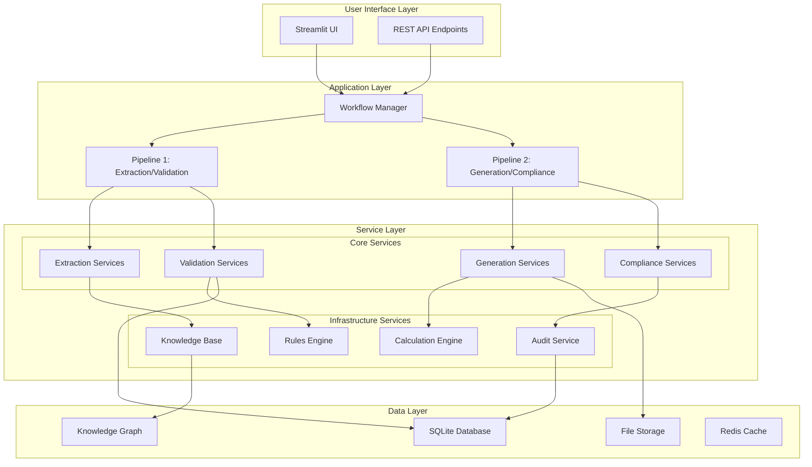
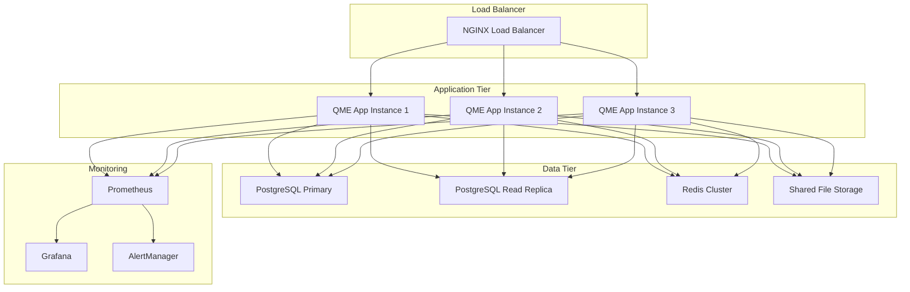

# Production-Ready QME System Design

## Overview

This design document outlines the architecture and implementation approach for achieving production readiness of the QME system. The design focuses on consolidating existing implementations, resolving backend errors, ensuring complete UI integration with the dual-pipeline architecture, and organizing the codebase for maintainability and scalability.

## Architecture

### High-Level System Architecture



### Dual-Pipeline Architecture

The system implements two distinct but integrated pipelines:

**Pipeline 1: Evidence Extraction and Validation**
- Document ingestion and text extraction
- Structured field extraction with confidence scoring
- Evidence validation against thresholds
- Knowledge graph population
- Audit trail generation

**Pipeline 2: Content Generation and Compliance**
- Evidence-driven content generation
- Programmatic impairment calculations
- Professional template assembly
- Legal compliance validation
- Final quality assurance

## Components and Interfaces

### 1. Service Organization Structure

```
src/
├── core/                           # Core business logic
│   ├── extraction/                 # Document and field extraction
│   ├── validation/                 # Evidence and compliance validation
│   ├── generation/                 # Content and template generation
│   └── calculation/                # Programmatic calculations
├── infrastructure/                 # Infrastructure services
│   ├── knowledge/                  # Knowledge base and graph
│   ├── storage/                    # Data persistence
│   ├── monitoring/                 # Health checks and performance
│   └── configuration/              # Configuration management
├── workflow/                       # Workflow orchestration
│   ├── pipelines/                  # Pipeline implementations
│   ├── managers/                   # Workflow managers
│   └── state/                      # State management
└── interfaces/                     # External interfaces
    ├── ui/                         # User interface components
    ├── api/                        # REST API endpoints
    └── cli/                        # Command-line interface
```

### 2. Core Service Interfaces

#### IExtractionService
```python
class IExtractionService:
    async def extract_fields(self, document: Document) -> ExtractionResult
    async def calculate_confidence(self, fields: Dict) -> ConfidenceScores
    async def collect_evidence(self, fields: Dict) -> EvidenceCollection
```

#### IValidationService
```python
class IValidationService:
    async def validate_evidence(self, evidence: EvidenceCollection) -> ValidationResult
    async def check_thresholds(self, confidence: ConfidenceScores) -> ThresholdResult
    async def generate_audit_trail(self, validation: ValidationResult) -> AuditTrail
```

#### IGenerationService
```python
class IGenerationService:
    async def generate_content(self, validated_evidence: ValidationResult) -> GeneratedContent
    async def assemble_template(self, content: GeneratedContent) -> TemplateResult
    async def validate_compliance(self, template: TemplateResult) -> ComplianceResult
```

### 3. Workflow Manager Interface

```python
class WorkflowManager:
    async def execute_pipeline_1(self, document: Document) -> Pipeline1Result
    async def execute_pipeline_2(self, pipeline1_result: Pipeline1Result) -> Pipeline2Result
    async def get_workflow_status(self, workflow_id: str) -> WorkflowStatus
    async def cancel_workflow(self, workflow_id: str) -> bool
```

## Data Models

### Core Data Models

```python
@dataclass
class ExtractionResult:
    success: bool
    extracted_fields: Dict[str, Any]
    confidence_scores: Dict[str, float]
    evidence_snippets: Dict[str, List[EvidenceSnippet]]
    processing_time: float
    error_message: Optional[str]

@dataclass
class ValidationResult:
    is_valid: bool
    accepted_fields: Dict[str, Any]
    flagged_fields: Dict[str, Any]
    missing_fields: List[str]
    validation_errors: List[ValidationError]
    audit_trail: AuditTrail

@dataclass
class Pipeline1Result:
    extraction_result: ExtractionResult
    validation_result: ValidationResult
    knowledge_graph_updates: List[KGUpdate]
    workflow_status: WorkflowStatus

@dataclass
class Pipeline2Result:
    generated_content: GeneratedContent
    template_result: TemplateResult
    compliance_result: ComplianceResult
    final_document: bytes
    quality_score: float
```

## Error Handling

### Error Hierarchy

```python
class QMESystemError(Exception):
    """Base exception for QME system errors"""
    pass

class ExtractionError(QMESystemError):
    """Errors during document extraction"""
    pass

class ValidationError(QMESystemError):
    """Errors during evidence validation"""
    pass

class GenerationError(QMESystemError):
    """Errors during content generation"""
    pass

class ComplianceError(QMESystemError):
    """Errors during compliance validation"""
    pass
```

### Error Handling Strategy

1. **Graceful Degradation**: System continues operating with reduced functionality
2. **Retry Logic**: Automatic retry with exponential backoff for transient errors
3. **Circuit Breaker**: Prevent cascade failures by temporarily disabling failing services
4. **Error Reporting**: Comprehensive error logging with context and stack traces
5. **User Feedback**: Clear, actionable error messages in the UI

## Testing Strategy

### Testing Pyramid

1. **Unit Tests**: Individual service and component testing
2. **Integration Tests**: Service interaction and pipeline testing
3. **End-to-End Tests**: Complete workflow testing with real documents
4. **Performance Tests**: Load testing and performance validation
5. **Compliance Tests**: Legal and regulatory requirement validation

### Test Data Strategy

- **Canonical Documents**: AMA Guides, QME Study Guide, Sample reports
- **Test Patient Documents**: PQME files with known expected values
- **Edge Cases**: Malformed documents, missing fields, invalid data
- **Performance Benchmarks**: Large documents, concurrent processing

## Deployment Architecture

### Production Environment



### Configuration Management

- **Environment Variables**: API keys, database connections, feature flags
- **Configuration Files**: Service settings, validation rules, templates
- **Secrets Management**: Encrypted storage of sensitive configuration
- **Environment Profiles**: Development, staging, production configurations

## Security Considerations

### Data Protection

1. **Encryption at Rest**: Database and file storage encryption
2. **Encryption in Transit**: TLS for all API communications
3. **Access Control**: Role-based access control (RBAC)
4. **Audit Logging**: Comprehensive audit trails for compliance
5. **Data Anonymization**: PII protection in logs and error messages

### API Security

1. **Authentication**: JWT-based authentication
2. **Authorization**: Fine-grained permission system
3. **Rate Limiting**: Prevent abuse and ensure fair usage
4. **Input Validation**: Comprehensive input sanitization
5. **CORS Configuration**: Proper cross-origin resource sharing

## Performance Optimization

### Caching Strategy

1. **Application Cache**: In-memory caching of frequently accessed data
2. **Database Cache**: Query result caching with Redis
3. **File Cache**: Processed document caching
4. **CDN**: Static asset delivery optimization

### Database Optimization

1. **Indexing**: Optimized database indexes for query performance
2. **Connection Pooling**: Efficient database connection management
3. **Query Optimization**: Optimized SQL queries and ORM usage
4. **Partitioning**: Table partitioning for large datasets

### Monitoring and Alerting

1. **Health Checks**: Comprehensive system health monitoring
2. **Performance Metrics**: Response times, throughput, error rates
3. **Business Metrics**: Document processing success rates, template generation times
4. **Alerting**: Proactive alerting for system issues and performance degradation