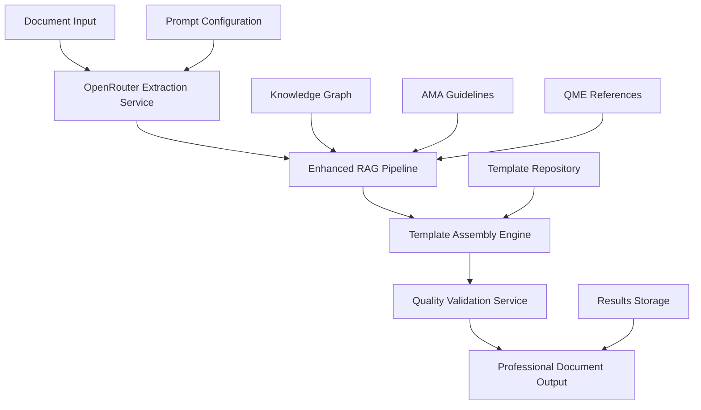

# Design Document

## Overview

This design addresses the critical quality issues in the QME document generation system through a comprehensive architectural refactor. The system will be restructured with enhanced modularity, improved information extraction using OpenRouter's Sonoma Sky Alpha model, and better separation of concerns. The refactor focuses on creating a plug-and-play architecture that maintains existing functionality while dramatically improving accuracy and maintainability.

## Architecture

### High-Level Architecture



### Modular Architecture Design

The refactored system will follow a clean, modular architecture with the following key principles:

1. **Separation of Concerns**: Each component has a single, well-defined responsibility
2. **Plugin Architecture**: Components can be easily replaced or extended
3. **Configuration-Driven**: Prompts, templates, and settings are externalized
4. **Result Preservation**: All generated documents are preserved in organized folders

## Components and Interfaces

### 1. OpenRouter Integration Service

**Purpose**: Replace current extraction with OpenRouter's Sonoma Sky Alpha model for superior accuracy.

**Interface**:
```python
class OpenRouterExtractionService:
    def extract_from_document(self, document_path: str, extraction_config: ExtractionConfig) -> ExtractionResult
    def extract_with_vision(self, document_path: str, prompt_template: str) -> VisionExtractionResult
    def validate_extraction_quality(self, result: ExtractionResult) -> QualityAssessment
```

**Key Features**:
- Vision-capable document processing for PDFs and images
- Configurable prompt templates for different extraction scenarios
- Built-in quality assessment and confidence scoring
- Retry logic with different prompt strategies

### 2. Enhanced RAG Pipeline

**Purpose**: Improved retrieval and generation with better context understanding.

**Interface**:
```python
class EnhancedRAGPipeline:
    def retrieve_context(self, query: str, document_context: Dict) -> RetrievalResult
    def generate_content(self, context: RetrievalResult, template: ContentTemplate) -> GeneratedContent
    def validate_generated_content(self, content: GeneratedContent) -> ValidationResult
```

**Key Features**:
- OpenRouter-powered context understanding
- Multi-source knowledge integration (AMA Guides, QME references)
- Enhanced vector search with relevance scoring
- Content validation against source materials

### 3. Professional Template Assembly Engine

**Purpose**: Reliable template assembly with consistent quality output.

**Interface**:
```python
class ProfessionalTemplateAssemblyEngine:
    def assemble_template(self, template_config: TemplateConfig, extracted_data: ExtractionResult) -> AssemblyResult
    def apply_professional_formatting(self, document: Document) -> FormattedDocument
    def validate_assembly_quality(self, result: AssemblyResult) -> QualityReport
```

**Key Features**:
- Template-driven document generation
- Professional formatting standards compliance
- Quality validation at each assembly step
- Error recovery and fallback mechanisms

### 4. Configuration Management System

**Purpose**: Centralized management of prompts, templates, and system settings.

**Structure**:
```
config/
├── prompts/
│   ├── extraction/
│   │   ├── patient_info.yaml
│   │   ├── medical_findings.yaml
│   │   └── impairment_rating.yaml
│   ├── generation/
│   │   ├── history_section.yaml
│   │   ├── examination_section.yaml
│   │   └── diagnosis_section.yaml
│   └── validation/
│       ├── quality_checks.yaml
│       └── compliance_rules.yaml
├── templates/
│   ├── qme_report_template.docx
│   ├── section_templates/
│   └── formatting_styles.yaml
└── settings/
    ├── openrouter_config.yaml
    ├── rag_pipeline_config.yaml
    └── quality_thresholds.yaml
```

### 5. Results Management System

**Purpose**: Organized storage and retrieval of generated documents and processing artifacts.

**Structure**:
```
results/
├── generated_documents/
│   ├── 2024/
│   │   ├── 01/
│   │   └── 02/
├── templates_archive/
│   ├── successful_templates/
│   └── template_versions/
├── processing_logs/
│   ├── extraction_logs/
│   ├── generation_logs/
│   └── quality_reports/
└── validation_reports/
    ├── quality_assessments/
    └── compliance_checks/
```

## Data Models

### Enhanced Extraction Result

```python
@dataclass
class EnhancedExtractionResult:
    document_id: str
    extraction_method: str  # "openrouter_sonoma_sky"
    confidence_score: float
    extracted_fields: Dict[str, ExtractedField]
    quality_assessment: QualityAssessment
    processing_metadata: ProcessingMetadata
    source_references: List[SourceReference]
    validation_results: List[ValidationResult]
```

### Template Assembly Configuration

```python
@dataclass
class TemplateAssemblyConfig:
    template_path: str
    formatting_rules: FormattingRules
    quality_requirements: QualityRequirements
    validation_rules: List[ValidationRule]
    output_settings: OutputSettings
    fallback_strategies: List[FallbackStrategy]
```

### Quality Assessment Model

```python
@dataclass
class QualityAssessment:
    overall_score: float
    completeness_score: float
    accuracy_score: float
    consistency_score: float
    compliance_score: float
    identified_issues: List[QualityIssue]
    improvement_suggestions: List[str]
    confidence_intervals: Dict[str, ConfidenceInterval]
```

## Error Handling

### Comprehensive Error Recovery

1. **Extraction Failures**:
   - Automatic retry with alternative prompts
   - Fallback to rule-based extraction
   - Partial extraction with quality flags

2. **Template Assembly Failures**:
   - Template validation before assembly
   - Graceful degradation with simplified templates
   - Error reporting with specific failure points

3. **Quality Validation Failures**:
   - Detailed quality reports with specific issues
   - Automated fix suggestions where possible
   - Manual review flagging for critical issues

### Error Logging and Monitoring

```python
class ErrorHandlingService:
    def log_extraction_error(self, error: ExtractionError) -> None
    def log_assembly_error(self, error: AssemblyError) -> None
    def generate_error_report(self, timeframe: TimeRange) -> ErrorReport
    def suggest_system_improvements(self, error_patterns: List[ErrorPattern]) -> List[Improvement]
```

## Testing Strategy

### Unit Testing

- **Component Isolation**: Each service component tested independently
- **Mock Dependencies**: External services (OpenRouter) mocked for consistent testing
- **Configuration Testing**: All configuration scenarios validated
- **Error Condition Testing**: Comprehensive error handling validation

### Integration Testing

- **End-to-End Workflows**: Complete document processing pipelines
- **Quality Validation**: Generated documents tested against quality standards
- **Performance Testing**: Processing time and resource usage validation
- **Regression Testing**: Ensure refactoring doesn't break existing functionality

### Quality Assurance Testing

- **Document Quality Comparison**: Before/after refactor quality metrics
- **Professional Review**: QME professionals validate output quality
- **Compliance Testing**: Legal and regulatory requirement validation
- **User Acceptance Testing**: End-user workflow validation

## Implementation Phases

### Phase 1: Core Infrastructure (Tasks 1-2)
- OpenRouter integration service
- Enhanced configuration management
- Basic quality validation framework

### Phase 2: Enhanced Processing (Tasks 3-4)
- Improved RAG pipeline with OpenRouter
- Professional template assembly engine
- Results management system

### Phase 3: Quality and Validation (Task 5)
- Comprehensive quality validation
- Error handling and recovery
- Performance optimization and monitoring

## Security and Compliance

### Data Security
- Secure API key management for OpenRouter
- Document encryption at rest and in transit
- Access logging and audit trails
- HIPAA compliance for medical data handling

### Quality Compliance
- AMA Guidelines compliance validation
- QME regulatory requirement adherence
- Professional standard verification
- Legal requirement validation

## Performance Considerations

### Optimization Strategies
- Caching of frequently used templates and configurations
- Parallel processing for multiple document handling
- Efficient memory management for large documents
- Response time optimization for interactive use

### Scalability Design
- Modular architecture supports horizontal scaling
- Configuration-driven scaling parameters
- Resource usage monitoring and alerting
- Load balancing for high-volume processing

## Migration Strategy

### Preserving Existing Assets
- All current generated documents moved to templates archive
- Existing configurations migrated to new format
- Current test cases preserved and enhanced
- Backward compatibility maintained where possible

### Gradual Rollout
- Component-by-component replacement
- A/B testing between old and new systems
- Quality comparison and validation
- User training and documentation updates