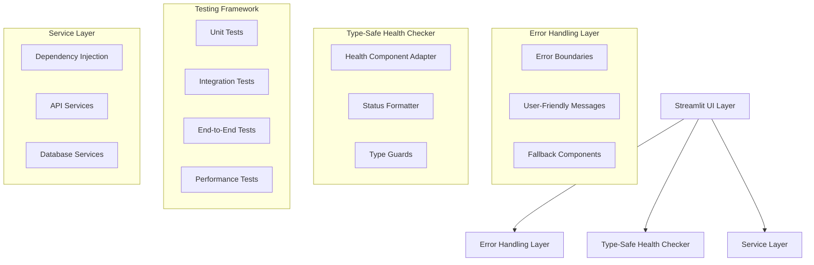

# UI Component Fixes and Comprehensive Testing Design

## Overview

This design document outlines the technical approach for fixing critical UI component errors and implementing comprehensive testing coverage for the QME system. The solution focuses on resolving ComponentHealth object integration issues, improving error handling throughout the UI, and creating robust test suites for all endpoints and routes.

## Architecture

### Current Issues Analysis

The system currently suffers from several UI integration issues:

1. **ComponentHealth Object Misuse**: UI code treats ComponentHealth dataclass objects as dictionaries, causing `.get()` attribute errors
2. **Inconsistent Error Handling**: Missing error boundaries and inconsistent error message patterns across UI components
3. **Incomplete Test Coverage**: Limited test coverage for UI components and missing integration tests for critical workflows
4. **Service Integration Issues**: UI components don't properly handle service instantiation failures or missing dependencies
5. **Performance Bottlenecks**: No performance testing or monitoring for UI responsiveness

### Target Architecture



## Components and Interfaces

### 1. Health Status Adapter

**Purpose**: Provide type-safe access to health check results with backward compatibility

**Components**:
- `HealthStatusAdapter`: Converts between ComponentHealth objects and UI-friendly formats
- `TypeGuards`: Runtime type checking for health objects
- `StatusFormatter`: Consistent formatting for health status display

**Interface**:
```python
class HealthStatusAdapter:
    def adapt_component_health(self, health: ComponentHealth) -> Dict[str, Any]
    def adapt_system_health(self, health: SystemHealth) -> Dict[str, Any]
    def is_healthy(self, health: Union[ComponentHealth, Dict]) -> bool
    def get_status_message(self, health: Union[ComponentHealth, Dict]) -> str
```

### 2. UI Error Handling System

**Purpose**: Provide comprehensive error handling and user-friendly error messages

**Components**:
- `UIErrorBoundary`: Catches and handles UI component errors
- `ErrorMessageFormatter`: Converts technical errors to user-friendly messages
- `FallbackRenderer`: Provides fallback UI components when services fail

**Interface**:
```python
class UIErrorBoundary:
    def handle_component_error(self, error: Exception, component: str) -> None
    def render_error_fallback(self, error: Exception) -> None
    def get_recovery_suggestions(self, error: Exception) -> List[str]
```

### 3. Comprehensive Test Framework

**Purpose**: Provide complete test coverage for UI components and backend integration

**Components**:
- `UITestRunner`: Automated testing for Streamlit components
- `EndpointTester`: Comprehensive API endpoint testing
- `IntegrationTestSuite`: End-to-end workflow testing
- `PerformanceTestRunner`: UI performance and load testing

**Interface**:
```python
class UITestRunner:
    def test_page_loading(self, page_name: str) -> TestResult
    def test_component_rendering(self, component: str) -> TestResult
    def test_user_interactions(self, interactions: List[Interaction]) -> TestResult
```

### 4. Service Integration Validator

**Purpose**: Ensure proper UI-backend service integration with graceful degradation

**Components**:
- `ServiceHealthChecker`: Validates service availability before UI access
- `DependencyValidator`: Checks service dependencies and configurations
- `GracefulDegradation`: Provides fallback functionality when services are unavailable

**Interface**:
```python
class ServiceIntegrationValidator:
    def validate_service_availability(self, service_name: str) -> ValidationResult
    def check_dependencies(self, component: str) -> DependencyStatus
    def enable_graceful_degradation(self, failed_services: List[str]) -> None
```

## Data Models

### Health Status Models
```python
@dataclass
class UIHealthStatus:
    is_healthy: bool
    message: str
    details: Dict[str, Any]
    component_statuses: Dict[str, ComponentStatus]
    
@dataclass
class ComponentStatus:
    name: str
    healthy: bool
    message: str
    response_time_ms: Optional[float] = None
```

### Test Result Models
```python
@dataclass
class TestResult:
    test_name: str
    passed: bool
    error_message: Optional[str]
    execution_time_ms: float
    coverage_percentage: float
    
@dataclass
class TestSuite:
    name: str
    results: List[TestResult]
    overall_passed: bool
    total_coverage: float
```

## Error Handling

### ComponentHealth Integration Fix
1. **Type Detection**: Identify whether health objects are ComponentHealth dataclasses or legacy dictionaries
2. **Adapter Pattern**: Create adapters that provide consistent interface regardless of object type
3. **Graceful Fallback**: Handle cases where health data is unavailable or malformed
4. **Type Safety**: Add runtime type checking to prevent attribute errors

### UI Error Boundaries
1. **Component-Level**: Wrap each major UI component with error boundaries
2. **Page-Level**: Implement page-level error handling with recovery options
3. **Global Handler**: Catch unhandled errors and provide system-wide error reporting
4. **User Feedback**: Convert technical errors into actionable user messages

### Service Integration Errors
1. **Dependency Checking**: Validate service availability before UI component rendering
2. **Fallback Components**: Provide alternative UI when services are unavailable
3. **Progressive Enhancement**: Enable features as services become available
4. **Error Recovery**: Implement retry mechanisms and service reconnection

## Testing Strategy

### Unit Testing
- Test individual UI component rendering
- Test health status adapter functionality
- Test error handling mechanisms
- Test service integration validators

### Integration Testing
- Test complete UI page loading with backend services
- Test document upload and processing workflows
- Test Q&A interface with API providers
- Test template generation end-to-end

### End-to-End Testing
- Test complete user workflows from upload to download
- Test error scenarios and recovery paths
- Test concurrent user scenarios
- Test system behavior under load

### Performance Testing
- Test UI responsiveness under normal load
- Test memory usage and leak detection
- Test concurrent user handling
- Test large document processing performance

## Implementation Phases

### Phase 1: ComponentHealth Integration Fix
1. Create HealthStatusAdapter to handle both ComponentHealth objects and dictionaries
2. Update main_app.py to use type-safe health status access
3. Add runtime type checking for health objects
4. Test health status display across all UI components

### Phase 2: UI Error Handling Enhancement
1. Implement UIErrorBoundary for component-level error handling
2. Create user-friendly error message formatting
3. Add fallback components for service failures
4. Implement error recovery mechanisms

### Phase 3: Comprehensive Test Suite Creation
1. Create UI test framework for Streamlit components
2. Implement endpoint testing for all backend routes
3. Create integration tests for critical workflows
4. Add performance and load testing capabilities

### Phase 4: Service Integration Validation
1. Implement service health checking before UI access
2. Create dependency validation for UI components
3. Add graceful degradation for missing services
4. Test service integration under various failure scenarios

### Phase 5: Performance and Stability Testing
1. Implement UI performance monitoring
2. Create load testing for concurrent users
3. Add memory leak detection and monitoring
4. Validate system stability under stress conditions

## Testing Implementation Details

### UI Component Tests
```python
# Test structure for UI components
class TestUIComponents:
    def test_main_app_loading(self)
    def test_upload_page_rendering(self)
    def test_qa_interface_functionality(self)
    def test_template_generation_ui(self)
    def test_health_status_display(self)
```

### Backend Endpoint Tests
```python
# Test structure for backend endpoints
class TestBackendEndpoints:
    def test_document_upload_endpoint(self)
    def test_extraction_service_endpoint(self)
    def test_qa_service_endpoint(self)
    def test_template_generation_endpoint(self)
    def test_health_check_endpoint(self)
```

### Integration Test Scenarios
```python
# Test structure for integration scenarios
class TestIntegrationScenarios:
    def test_complete_document_processing_workflow(self)
    def test_qa_with_document_context(self)
    def test_template_generation_with_validation(self)
    def test_error_handling_and_recovery(self)
    def test_concurrent_user_scenarios(self)
```

## Success Criteria

### Functional Requirements
- All ComponentHealth attribute errors resolved
- All UI pages load without import or runtime errors
- Complete test coverage for critical workflows
- Proper error handling and user feedback

### Performance Requirements
- UI page load times under 3 seconds
- Support for 10+ concurrent users
- Memory usage remains stable during extended use
- Test suite execution time under 5 minutes

### Quality Requirements
- 80%+ test coverage for UI components
- 90%+ test coverage for backend services
- Zero critical UI errors in production
- Comprehensive error logging and monitoring